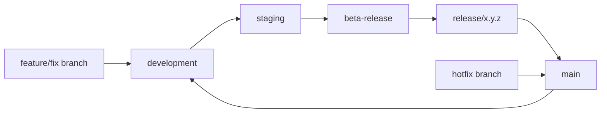

# Branching & release strategy — GyroERP Backend

This document defines **how code moves** from feature work to production.
All contributors must follow this model. Enforcement is via **GitHub branch protection**, **CI**, and **pull request rules**.

---

## Branch hierarchy



| Branch | Purpose | Merges from | Deploy / QA |
|--------|---------|-------------|-------------|
| `feature/*` `fix/*` | New work tied to an issue | — (short-lived) | Local / CI |
| **`development`** | Integration of approved features | `feature/*`, `fix/*` | Dev environment |
| **`staging`** | Pre-production QA | `development` only | Staging QA |
| **`beta-release`** | Beta testing with stakeholders | `staging` only | Beta environment |
| **`release/x.y.z`** | Release candidate freeze | `beta-release` only | Release QA |
| **`main`** | Production-stable code | `release/*` or `hotfix/*` | Production |
| `hotfix/*` | Emergency production fix | branched from `main` | Hotfix QA |

**Never push directly to** `development`, `staging`, `beta-release`, or `main`.

---

## Branch naming (required)

| Type | Pattern | Example |
|------|---------|---------|
| Feature | `feature/<issue#>-short-name` | `feature/12-gyroerp-kernel` |
| Bug fix | `fix/<issue#>-short-name` | `fix/45-invoice-rounding` |
| Hotfix | `hotfix/<issue#>-short-name` | `hotfix/99-auth-token-leak` |
| Release | `release/<semver>` | `release/1.0.0` |

Always include the **GitHub issue number** in the branch name.

---

## Standard workflow (feature)

### 1. Create a ticket

1. Open [New issue](https://github.com/GyroERP/backend/issues/new/choose) → **Feature request** (or Bug / Task)
2. Add to [GyroERP Development project](https://github.com/orgs/GyroERP/projects/3)
3. Set Priority, Ticket type, Module on the project card

### 2. Create a branch **from `development`**

```bash
git fetch origin
git checkout development
git pull origin development
git checkout -b feature/12-gyroerp-kernel
```

### 3. Implement & push

```bash
git push -u origin feature/12-gyroerp-kernel
```

### 4. Open PR → `development`

- Title: `feat: add GyroERP kernel scaffold (#12)`
- Body: `Fixes GyroERP/backend#12`
- CI must pass (Django checks + Ruff)
- 1 approving review required

### 5. Promote through environments (PR chain)

| Step | PR | Template |
|------|-----|----------|
| Dev → Staging | `development` → `staging` | [Promotion PR](https://github.com/GyroERP/backend/compare/staging...development?expand=1&template=promotion.md) |
| Staging → Beta | `staging` → `beta-release` | Promotion PR |
| Beta → Release | `beta-release` → `release/1.0.0` | Promotion PR |
| Release → Main | `release/1.0.0` → `main` | Promotion PR + tag `v1.0.0` |

Each promotion requires:

- All CI checks green
- QA sign-off noted in PR description
- 1+ approval (stricter on `main`)

---

## Hotfix workflow

Production emergency only:

```bash
git checkout main
git pull origin main
git checkout -b hotfix/99-critical-fix
# fix, PR to main
# then cherry-pick or PR same fix to development
```

---

## CI on every branch

CI runs on:

- Push to `development`, `staging`, `beta-release`, `main`, `release/*`
- Pull requests targeting any protected branch
- Feature/fix/hotfix branches via PR

See [`.github/workflows/ci.yml`](.github/workflows/ci.yml).

---

## Related docs

- [RELEASE.md](RELEASE.md) — versioning and GitHub Releases
- [PROJECT.md (org)](https://github.com/GyroERP/.github/blob/main/PROJECT.md) — tickets & project board
- [BRANCH_PROTECTION.md](.github/BRANCH_PROTECTION.md) — protection rules reference
